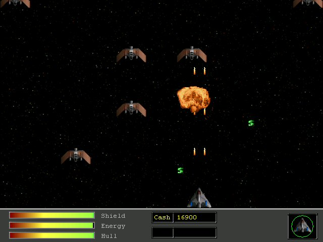



## VBSPaceShooter AKA Invasion or VBRaptor

### Description

The vbRaptor clone I've been working on for quite some time now. It started out using bitblt and has now advanced to DirectX. You'll find the big difference between this version and the previous versions isn't just the DirectX, but ingame menu's, custom ship with a shop where you can upgrade your ships abilities and saving your character so you can come back and play later.
 
### More Info
 

             |
---                |---
**Submitted On**   |2003-09-08 01:23:40
**By**             |[Stewart](https://github.com/Planet-Source-Code/PSCIndex/blob/master/ByAuthor/stewart.md)
**Level**          |Intermediate
**User Rating**    |5.0 (35 globes from 7 users)
**Compatibility**  |VB 6\.0
**Category**       |[Games](https://github.com/Planet-Source-Code/PSCIndex/blob/master/ByCategory/games__1-38.md)
**World**          |[Visual Basic](https://github.com/Planet-Source-Code/PSCIndex/blob/master/ByWorld/visual-basic.md)
**Archive File**   |[VBSPaceSho1813691132004\.zip](https://github.com/Planet-Source-Code/stewart-vbspaceshooter-aka-invasion-or-vbraptor__1-57075/archive/master.zip)

